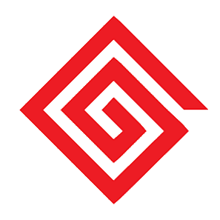

# ioBroker.goodwePV

**Tests:** 

## goodwePV adapter for ioBroker

Communication with GoodWe Inverter ET/EH/BH/BT Series

## Based on

This adapter is based on [ioBroker.goodwe](https://github.com/FossyTom/ioBroker.goodwe) by [FossyTom](https://github.com/FossyTom) (Thomas Schönberger), licensed under MIT.

## Changelog
<!--
	Placeholder for the next version (at the beginning of the line):
	### **WORK IN PROGRESS**
-->
### 0.0.1 (2024)
* (hombach) initial release based on ioBroker.goodwe by FossyTom

## License
MIT License

Copyright (c) 2024 hombach <goodwePV@homba.ch>
Copyright (c) 2023 Thomas Schönberger <SchoenbergerThomas@freenet.de> (original ioBroker.goodwe)

Permission is hereby granted, free of charge, to any person obtaining a copy
of this software and associated documentation files (the "Software"), to deal
in the Software without restriction, including without limitation the rights
to use, copy, modify, merge, publish, distribute, sublicense, and/or sell
copies of the Software, and to permit persons to whom the Software is
furnished to do so, subject to the following conditions:

The above copyright notice and this permission notice shall be included in all
copies or substantial portions of the Software.

THE SOFTWARE IS PROVIDED "AS IS", WITHOUT WARRANTY OF ANY KIND, EXPRESS OR
IMPLIED, INCLUDING BUT NOT LIMITED TO THE WARRANTIES OF MERCHANTABILITY,
FITNESS FOR A PARTICULAR PURPOSE AND NONINFRINGEMENT. IN NO EVENT SHALL THE
AUTHORS OR COPYRIGHT HOLDERS BE LIABLE FOR ANY CLAIM, DAMAGES OR OTHER
LIABILITY, WHETHER IN AN ACTION OF CONTRACT, TORT OR OTHERWISE, ARISING FROM,
OUT OF OR IN CONNECTION WITH THE SOFTWARE OR THE USE OR OTHER DEALINGS IN THE
SOFTWARE.
